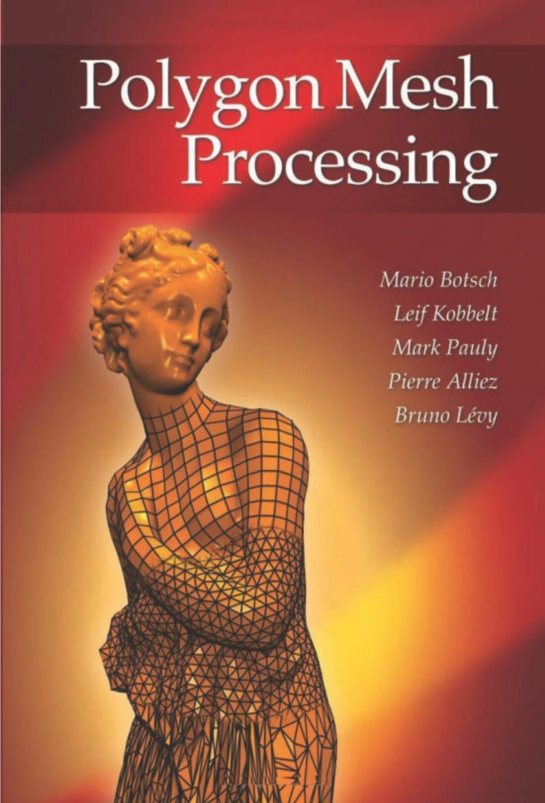

# 《多边形网格处理》
> 本文档是对**《Polygon Mesh Processing》**一书的翻译，英文原版电子书已上传至仓库，如有需要可[点此下载](https://github.com/A2CGP/tutorials/tree/main/downloads/Polygon-Mesh-Processing.pdf)。

　　几何处理或网格处理是一个快速发展的研究领域，它使用应用数学、计算机科学和工程学的概念来设计用于复杂 3D 模型的采集、重建、分析、操作、模拟和传输的高效算法。几何处理算法的应用已经涵盖了从多媒体、娱乐和经典计算机辅助设计到生物医学计算、逆向工程和科学计算的广泛领域。在过去的几年里，三角形网格变得越来越流行，因为不规则三角形网格已经发展成为传统样条曲面的有价值的替代品。

　　本书讨论了基于三角形网格的整个几何处理流程：管道从数据输入开始（例如，通过 3D 扫描技术获取的模型），然后这些数据经历错误消除、网格创建、平滑、转换、变形等过程。作者详细介绍了使用三角形网格的这些过程的技术。
