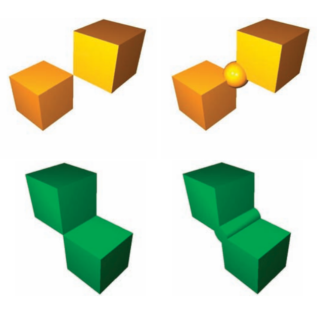
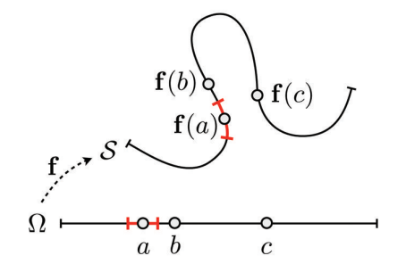

# 1.1 曲面的定义及属性
在计算机图形应用程序的上下文中，曲面的常见定义是“嵌入 IR3 中的可定向连续二维流形”。 直观上，这可以理解为非退化 3D 实体的边界表面，其中非退化意味着该实体没有任何无限薄的部分或特征，使得该表面正确地将“内部”和“外部”分开 实心（见图 1.1）。 具有边界的表面是可以通过填充孔来扩展到适当的流形表面的表面。

由于在大多数应用中，关于输入表面的原始信息是通过离散采样获得的（即，通过评估是否已经存在数字表示，或者通过探测输入是否来自真实对象），生成 数学表面表示是为了建立连续性。 这需要在样本之间建立一致的邻域关系。 在这种情况下，一致性是指存在从中抽取样本的流形表面。

虽然这种所谓的测地线邻域关系（与
空间邻域关系）很难在隐式表示中访问，如果 Ω 中相应的原像彼此靠近，则很容易从表面上的两个点在测地线附近的参数表示中提取（参见 图 1.2)。 从这个观察中，我们可以推导出局部流形的另一种表征：连续参数曲面在表面点 p 处是局部流形的，如果对于围绕 p 的足够小的半径 δ 球体内的每个其他表面点 q，相应的预 图像包含在围绕 p 的原像的一些半径 ε = O(δ) 的圆中。 表达这种情况的一种更直观的方式是说位于 p 周围足够小的 δ 球内的表面块在拓扑上等同于（同胚）圆盘。 由于第二个定义不需要参数化，因此它也适用于隐式表示

当从一组离散样本生成连续表面时，我们可以要求该表面对样本进行插值，或者根据特定的规定公差对样本进行近似。 后一种情况在实际应用中被认为更相关，因为样本通常受到位置噪声的影响，并且样本之间的表面无论如何都是近似值。 在下一节中，我们将更详细地考虑近似问题。
![图1.3. 三个公平表面的例子，它们定义了两个圆柱体之间的混合：一个最小化表面积的膜表面（左），一个最小化总曲率的薄板表面（中心），以及一个最小化平均曲率变化的表面（ 正确的）。（图片取自 [Botsch and Kobbelt 04a]。c 2004 ACM,Inc。经许可包含在此处](../public/figure1-3.png)

除了一组定义明确的尖锐特征曲线和角外，表面通常应该是光滑的。 在数学上，这是通过函数 f 或 F 具有的连续导数 k 的数量来衡量的。 请注意，仅当 f 的偏导数或 F 的梯度分别不在局部消失（正则性）时，C k 平滑度的这种分析定义才符合对平滑度的直观几何理解。

对曲面更严格的要求是公平性，不仅要考虑导数的连续性，还要考虑它们的大小和变化。 对于公平的美学概念没有一般的正式定义，但如果例如曲率或其变化被全局最小化，则表面通常被认为是公平的（见图 1.3）。

在第 3 章中，我们将解释如何将曲率的概念推广到多边形网格，以便将平滑度和公平性等属性也应用于网格（参见第 4 章）。